# Manufacturing Hub — Workflow Diagrams

---

## 1. System Architecture Overview

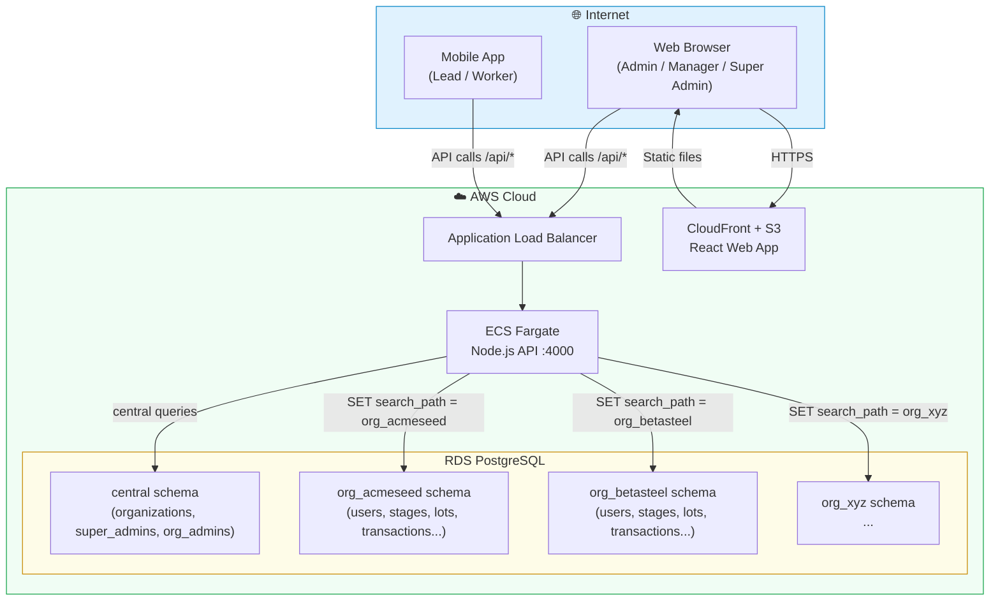

---

## 2. User Role Hierarchy & Access

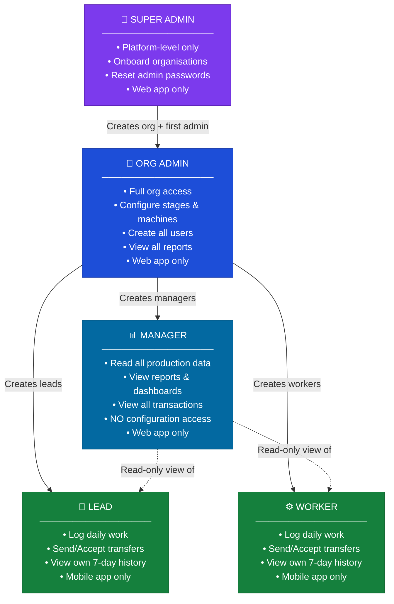

---

## 3. Login & Authentication Flow

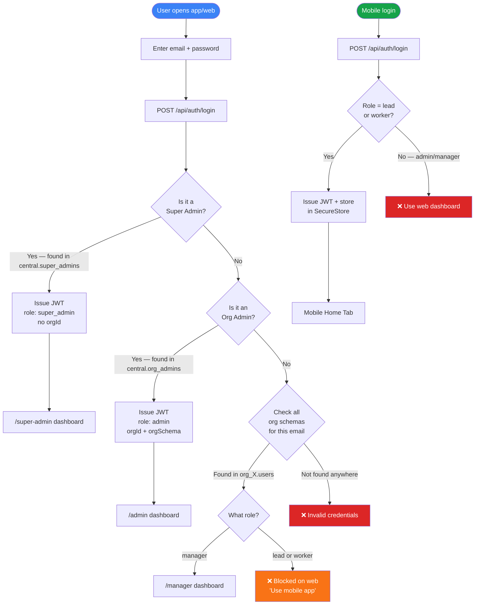

---

## 4. Organisation Onboarding Flow (Super Admin)

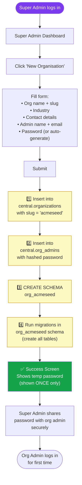

---

## 5. Admin Setup Flow (One-time Configuration)

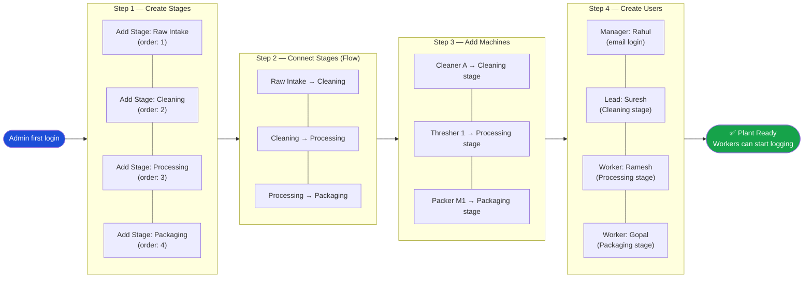

---

## 6. Core Material Flow — Lot Journey

```mermaid
flowchart TD
    RM(["🚛 Raw Material Arrives\n5000 kg Wheat — LOT-2024-031"])

    RM --> CREATE_LOT["Admin creates Lot\nLOT-2024-031\nQty: 5000 kg\nStarts at: Raw Intake"]

    CREATE_LOT --> STAGE1

    subgraph STAGE1["📦 Stage 1 — Raw Material Intake"]
        W1_LOG["Gopal logs work:\nInput: 5000 kg\nProcessed: 5000 kg\nOutput: 4950 kg\nLoss: 50 kg ⚠️"]
        W1_TRANSFER["Gopal sends transfer:\n4950 kg → Cleaning"]
    end

    STAGE1 --> PENDING1{{"⏳ Transfer PENDING\nRaju must accept"}}
    PENDING1 -->|"Raju taps Accept ✅"| STAGE2

    subgraph STAGE2["🌀 Stage 2 — Cleaning & Grading"]
        W2_LOG["Raju logs work:\nInput: 4950 kg\nProcessed: 4950 kg\nOutput: 4860 kg\nLoss: 90 kg ⚠️\nMachine: Air Cleaner A"]
        W2_TRANSFER["Raju sends transfer:\n4860 kg → Processing"]
    end

    STAGE2 --> PENDING2{{"⏳ Transfer PENDING\nSuresh must accept"}}
    PENDING2 -->|"Suresh taps Accept ✅"| STAGE3

    subgraph STAGE3["⚙️ Stage 3 — Processing"]
        W3_LOG["Suresh logs work:\nInput: 4860 kg\nProcessed: 4860 kg\nOutput: 4800 kg\nLoss: 60 kg ⚠️\nMachine: Thresher 1"]
        W3_TRANSFER["Suresh sends transfer:\n4800 kg → Packaging"]
    end

    STAGE3 --> PENDING3{{"⏳ Transfer PENDING\nGopal must accept"}}
    PENDING3 -->|"Gopal taps Accept ✅"| STAGE4

    subgraph STAGE4["📦 Stage 4 — Packaging"]
        W4_LOG["Gopal logs work:\nInput: 4800 kg\nProcessed: 4800 kg\nOutput: 4780 kg\nLoss: 20 kg ⚠️\nMachine: Packer M1"]
    end

    STAGE4 --> COMPLETE["✅ Admin marks Lot COMPLETED\nTotal Loss: 220 kg (4.4%)\nFinished: 4780 kg"]

    style RM fill:#f97316,color:#fff
    style COMPLETE fill:#16a34a,color:#fff
    style PENDING1 fill:#fef9c3,stroke:#ca8a04
    style PENDING2 fill:#fef9c3,stroke:#ca8a04
    style PENDING3 fill:#fef9c3,stroke:#ca8a04
```

---

## 7. Worker Daily Work Logging (Mobile App)

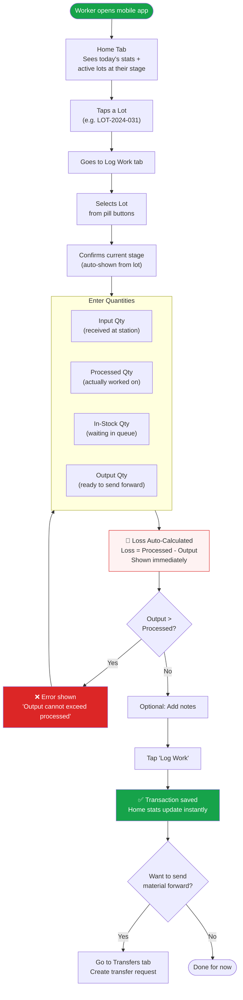

---

## 8. Material Transfer Flow (Stage to Stage)

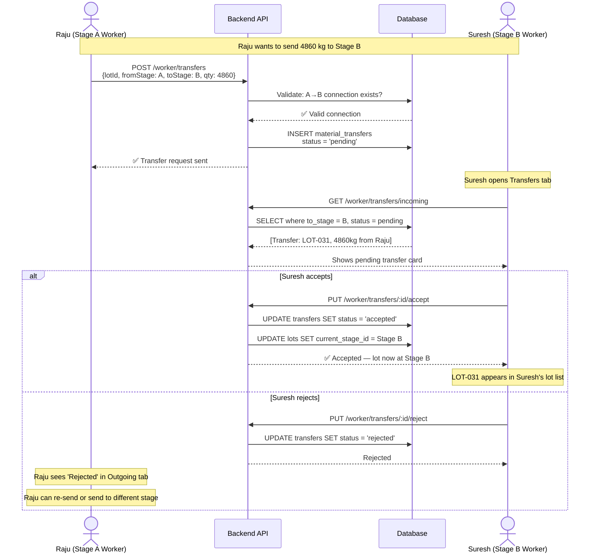

---

## 9. Reports & Dashboard Data Flow

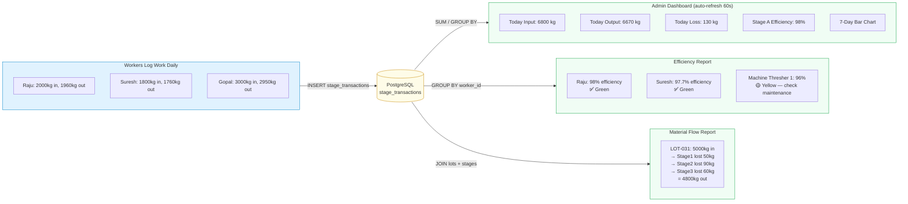

---

## 10. Stage Configuration — DAG Examples

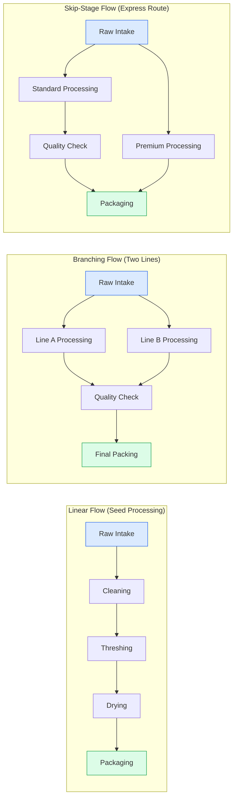

---

## 11. Full System Entity Relationship

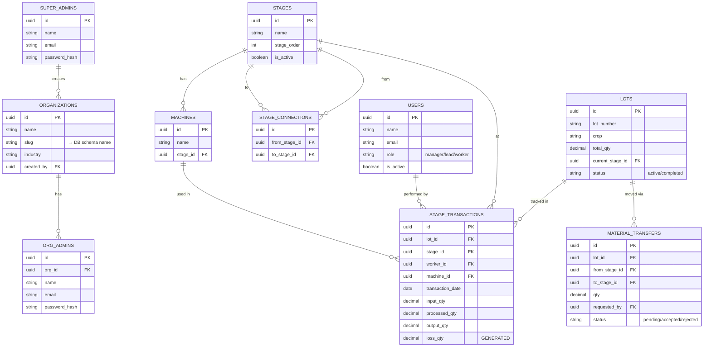

---

## 12. Multi-Tenant Request Lifecycle

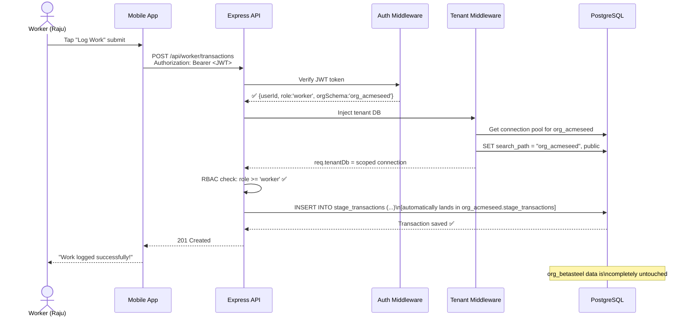
